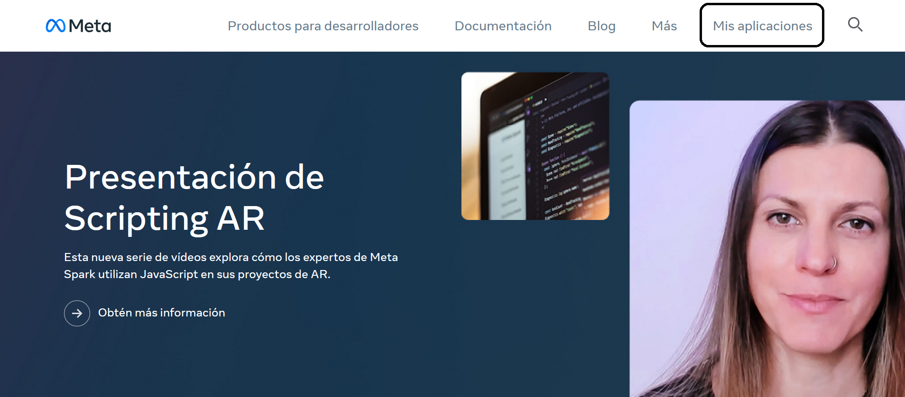
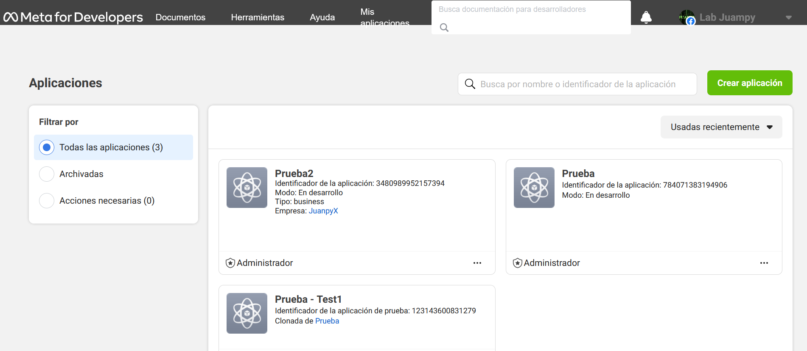
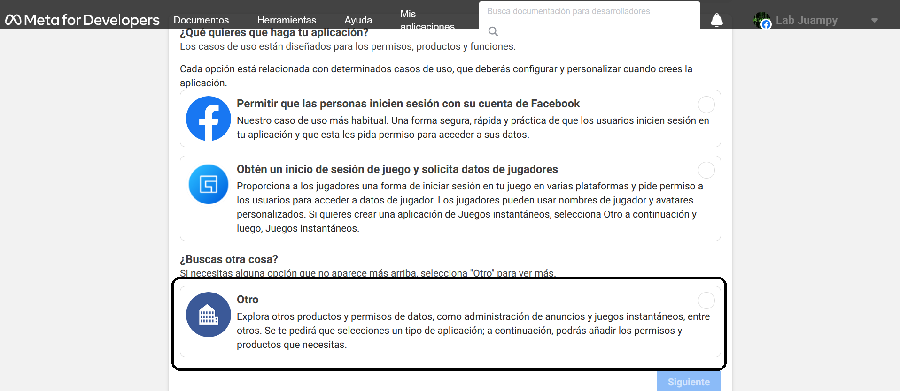
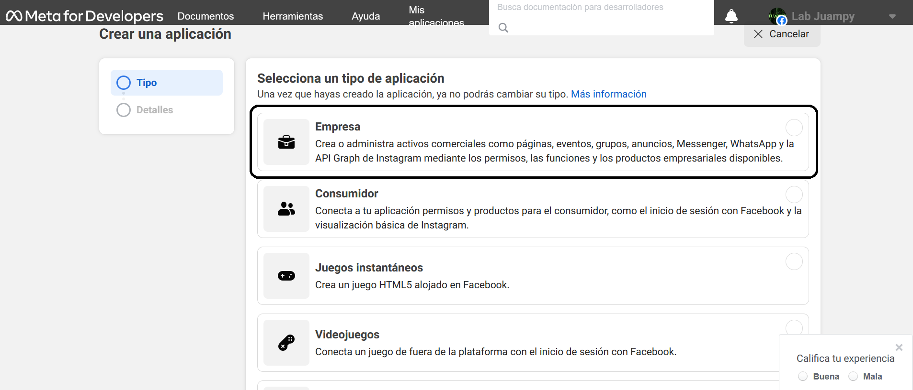
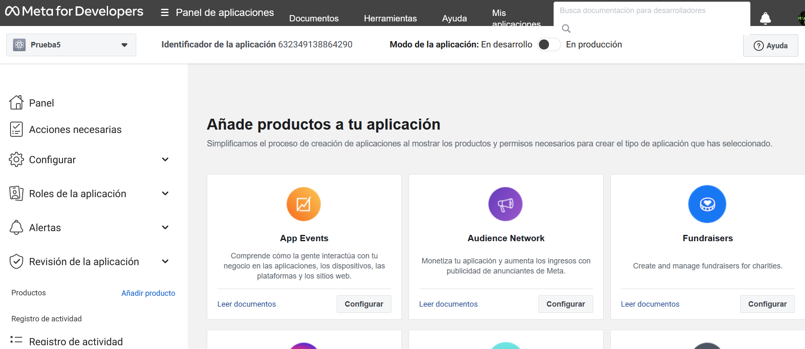

# Whatsapp Cloud API

## Introduccion

Whatsapp API nos permite administrar la mensajeria desde nuestra aplicaicon, ya sea para envios de notificaciones, mensajes automatizados, respuestas automáticas e interacciones.

- Envío de mensajes: Las empresas pueden enviar mensajes de texto, imágenes, videos y otros tipos de archivos a sus clientes.

- Plantillas de mensajes: Las empresas pueden utilizar plantillas de mensajes predefinidas para enviar notificaciones y mensajes estructurados a sus clientes.

- Respuestas automáticas: Se pueden configurar respuestas automáticas para ciertos mensajes recibidos, lo que ayuda a gestionar las interacciones con los clientes de manera más eficiente.

## Consideraciones

Antes de empesar, debera tener una cuenat activa de facebook activa y un endpoint configurado para recibir y emitir codigo de verificacion.

## Crear proyecto

Para empezar dirigase a la pagina de [desarrolladores](https://developers.facebook.com/?no_redirect=1) de meta. Luego dirigase a Mis Aplicaciones.

En esta seccion vera todas las aplicaciones que tiene activas.

### Iniciar una aplicacion

Para crear una aplicacion, ejecute el boton 'Crear aplicacion', una vez alli le saldra la siguiente informacion:

En este caso se utilizara para utilizar la API de whatsapp, por este motivo, seleccionamos la opcion 'otro' y luego 'Siguiente'.

Alli vera las opciones dependiendo el uso que se le dara a los recursos. Seleccionamos Empresa.

En esta interfaz vera tres campos a llenar (en el tercer campo debe tener una cuenta empresarial, si no lo tiene puede crear una desde [aqui](https://www.facebook.com/micro_site/url/?click_from_context_menu=true&country=AR&destination=https%3A%2F%2Fbusiness.facebook.com%2Fsettings%2Fwhatsapp-business-accounts&event_type=click&last_nav_impression_id=2zCmA3Z1KUUhQQlgx&max_percent_page_viewed=54&max_viewport_height_px=559&max_viewport_width_px=1280&orig_http_referrer=https%3A%2F%2Fdevelopers.facebook.com%2F&orig_request_uri=https%3A%2F%2Fwww.facebook.com%2Fbusiness%2Fhelp%2F2087193751603668&primary_cmsid=2087193751603668&primary_content_locale=es_ES&region=latam&scrolled=true&session_id=00Cw5GOiebZ51sskY&site=fb4b&extra_data[view_type]=v3_initial_view&extra_data[site_section]=help&extra_data[placement]=%2Fbusiness%2Fhelp%2F2087193751603668)).

Una vez vera el panel principal, donde se podra gestionar los recursos que se desea utilizar, como tambien los recursos que ya esten en uso.

.