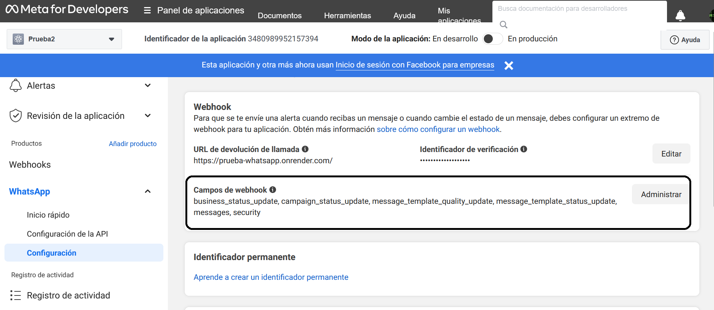
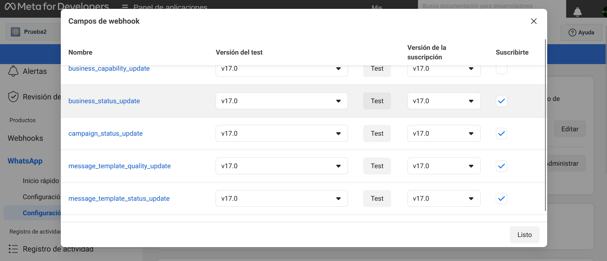
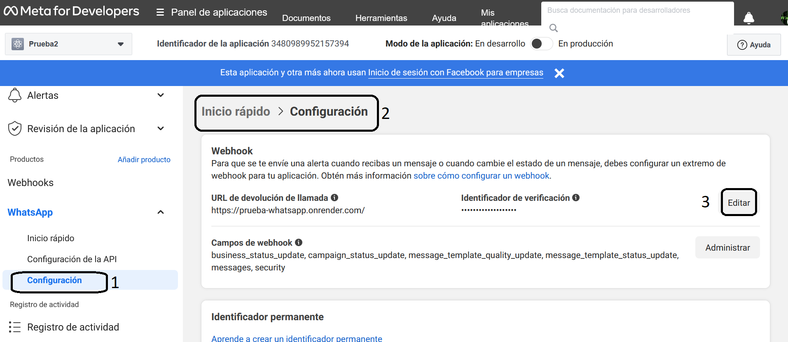
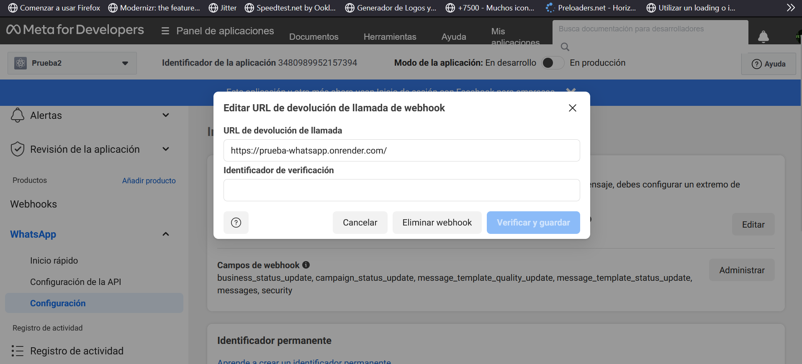

# Webhook

## Requisitos

- Poseer un servidor correctamente configurado para la devolción de respuestas definidas (lo veremos mas adelante).

- Seleccionar los elementos a recibir (lo puede configurar desde [aqui](https://developers.facebook.com/docs/graph-api/webhooks/getting-started#configure-webhooks-product)).

## Solicitudes

El webhook o servidor de whatsapp maneja dos tipos de solicitudes:

- Solicitud de verificación.

- Notificación de eventos.

### Solicitud de verificacion

El endpoint o su servidor recibira de whatsapp por GET tres valores:

- hub.mode: String cuyo valor debe ser igual a subscribe.
- hub.challenge: Clave que se debe devolver al servidor.
- hub.verify_token: Clave privada configurada anteriormente.

Url de ejemplo:

```textplain
GET https://www.your-clever-domain-name.com/webhooks? hub.mode=subscribe& hub.challenge=1158201444& hub.verify_token=meatyhamhock
```

```javascript
    //Ejemplo JS
let mode = req.query["hub.mode"];
let challange = req.query["hub.challenge"]
let token = req.query["hub.verify_token"]

```

El endpoint tiene que devolver un valor de estado 200 y el valor “challange” para que sea una conexión exitosa. Se entendera mejor en el siguiente ejemplo de un endpoint configurado.

```javascript
    // Ejemplo de un endpoint hecho en Node.js
app.get('/', (req, res) => {
    let mode = req.query["hub.mode"];
    let challange = req.query["hub.challenge"]
    let token = req.query["hub.verify_token"]
    
    if(mode === "subscribe" && token === mytoken){
        res
            .status(200)
            .send(challange);
    }else{
        res.status(404);
    }
})
```

### Notificaciones de eventos

Se debe configurar la carga util, significa que debe selecionar lo que quiere recibir al momento de que whatsapp le mande una notificación.



Una vez dentro, le aparecerá las siguientes opciones:



Puedes encontrar mas informacion util de la carga util [aqui](https://developers.facebook.com/micro_site/url/?click_from_context_menu=true&country=AR&destination=https%3A%2F%2Fdevelopers.facebook.com%2Fdocs%2Fgraph-api%2Fwebhooks%2Fgetting-started%23event-notifications&event_type=click&last_nav_impression_id=1G7RNRnMA1enywqO1&max_percent_page_viewed=95&max_viewport_height_px=559&max_viewport_width_px=1280&orig_http_referrer=https%3A%2F%2Fdevelopers.facebook.com%2Fdocs%2Fgraph-api%2Fwebhooks%2Fgetting-started&orig_request_uri=https%3A%2F%2Fdevelopers.facebook.com%2Fajax%2Fdocs%2Fnav%2F%3Fpath1%3Dgraph-api%26path2%3Dwebhooks%26path3%3Dgetting-started&region=latam&scrolled=true&session_id=1z0YMWEdgDozFddvN&site=developers).

## Finalizacion de la configuracion del Webhook

Una vez finalizada la configuración del Webhook a completar los datos restantes.



Allí se vera dos campos, el primero deberá colocar el PATH o la URL de su endpoint y el segundo una clave que el servidor debe procesar.




