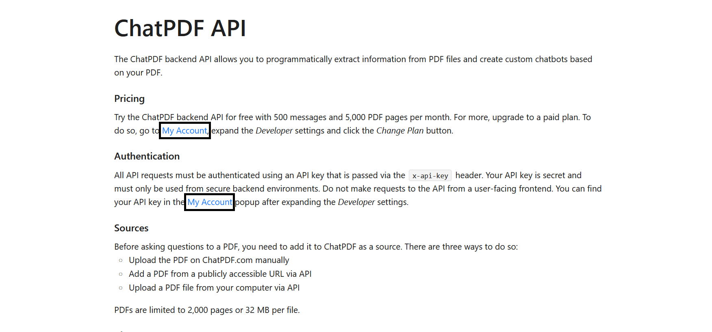
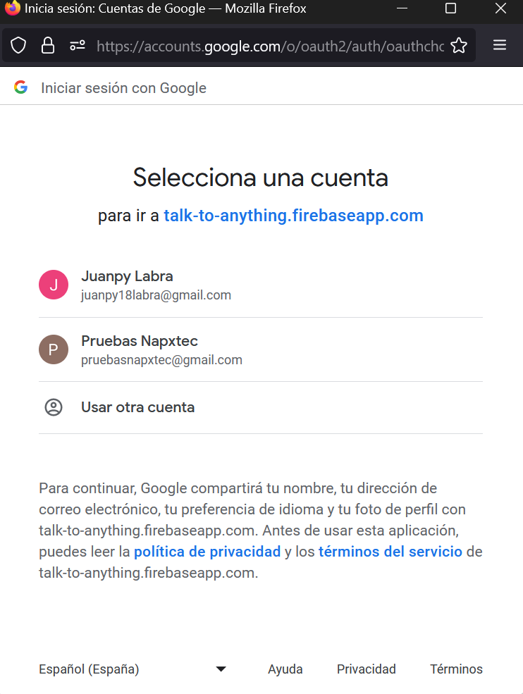
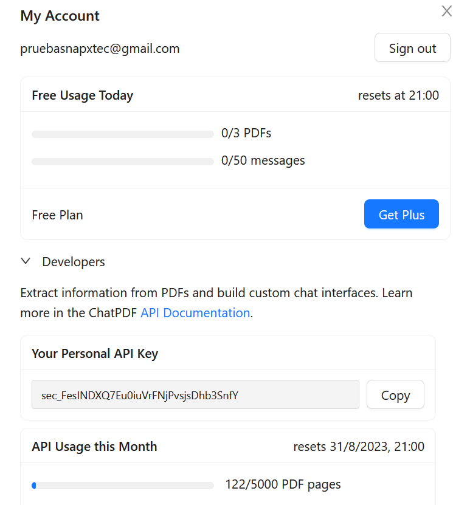

# Chat PDF Api

Esta API te permite procesar documentos PDF. Dicho procesamiento lo evalúa la IA, la cual devuelve una respuesta a una petición de información de dicho PDF, ya sea resúmenes, búsqueda, ideas generales, etc.

## Registro

Para comenzar, se requiere una cuenta activa en [chatPDF](https://www.chatpdf.com/docs/api/backend). Allí podrás visualizar la documentación original. En la sección de inicialización, podrás observar un botón con la denominación 'My Account'.




Una vez ejecutado el boton, se le redigirá a una página para iniciar sesion con sus credenciales de google.



Una vez registrado, se le mostrar un panel donde vera información sobre planes que le podria interesar, además tambien vera reflejada la api key por el cual podra utilizar para hacer solicitudes al endpoint.

## Gestor de cuenta

En la interfaz de usuario, podra administrar credenciales, planes, API KEY, uso y limites de servicio, etc.



## Consideraciones

- Limite de 32MB o 2000 paginas como maximo.

- Las solicitudes o preguntas anteriores al actual peticion se borrarán automaticamente.

- En la cabecera se tiene que especificar el rol, si es usuario o asistente.

## Integracion de un archivo PDF

### Via URL

Puedes agregar un archivo PDF cuyo origen se encuentre en la internet, siempre y cuando tenga a disposición una URL activa.

Ejemplo:

```plaintext
http://biblio3.url.edu.gt/Libros/put_tris.pdf
```

#### Body

Para agregar un archivo PDF debe colocar en el body el siguiente fragmento:

```JSON
{
  "url": "http://biblio3.url.edu.gt/Libros/put_tris.pdf"
}
```

#### Header

En este apartado debe indicar el API TOKEN y el formato de solicitud:

```JSON
{
    "x-api-key": "sec_xxxxxx", //sec_FesINDXQ7Eu0iuVrFNjPvsjsDhb3Sada24
    "Content-Type": "application/json",
  }
```

#### Envio de solicitud

Se debe envíar la solicitud con metodo POST, ya que deberá envíar información a esta URL:

```plaintext
https://api.chatpdf.com/v1/sources/add-url
```
#### Respuesta

La API devolverá un archivo JSON, el mismo muestra un sourceID que es un id unico del PDF que envió en la solicitud, ese id le va a permitir mas adelante recibir información del PDF mediante la IA en el chat.

```JSON
{
    "sourceId": "src_mxy28noYyTWsjuJH3T1XQ"
}
```

### Via Sistema de Archivos

El proceso es el mismo que el anterior, la diferencia es otorgar al PATH la ruta relativa del archivo PDF.

```JSON
{
  "url": "./ruta-relativa"
}
```

## Inicializar el chat

Hay que recordar que la conversación, luego de una nueva solicitud, se elimina en memoria la pregunta anterior.

##### Body
```JSON
{
  "sourceId": "src_d0wWUeH4X3f1hriiyY30b",
  "messages": [
    {
      "role": "user",
      "content": "que habla acerca de la vejez y en que paginas aparece esa palabra"
    }
  ]
}
```

Para seguir un lineamiento en la conversación, puede optar por usar un arreglo de objetos en la propiedad "mensaje", siempre y cuando no supere los 2500 tokens (caracteres). También existe un límite de 6 objetos en el arreglo.

Ejemplo:

```JSON
{
  "sourceId": "src_xxxxxx",
  "messages": [
    {
      "role": "user",
      "content": "How much is the world?"
    },
    {
      "role": "assistant",
      "content": "The world is 10 dollars."
    },
    {
      "role": "user",
      "content": "Where can I buy it?"
    }
  ]
}
```

Para recordar, el sourceId lo devuelve el endpoint de la API, solo es un ID del PDF que subió anteriormente y que está alojado en el servidor de la API.

#### Header

El encabezado es el mismo que el caso anterior (subir PDF).

#### Respuesta

La API devolvera el siguiente JSON:

```JSON
{
    "content": "La palabra \"vejez\" aparece en las páginas 6 y 7. Además, el tema principal del texto es la vejez."
}
```

### Eliminar el archivo PDF

Si deseas eliminar el archivo en el endpoint, haz lo siguiente:

Metodo POST

```plaintext
https://api.chatpdf.com/v1/sources/delete
```

#### Solicitud

```JSON
{ "sources": ["src_xxxxxx"] }
```

#### Respuesta

Confirmación de la eliminación.


